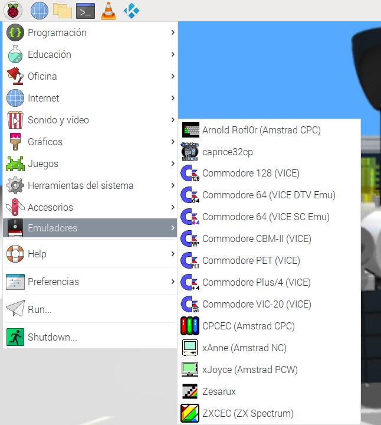
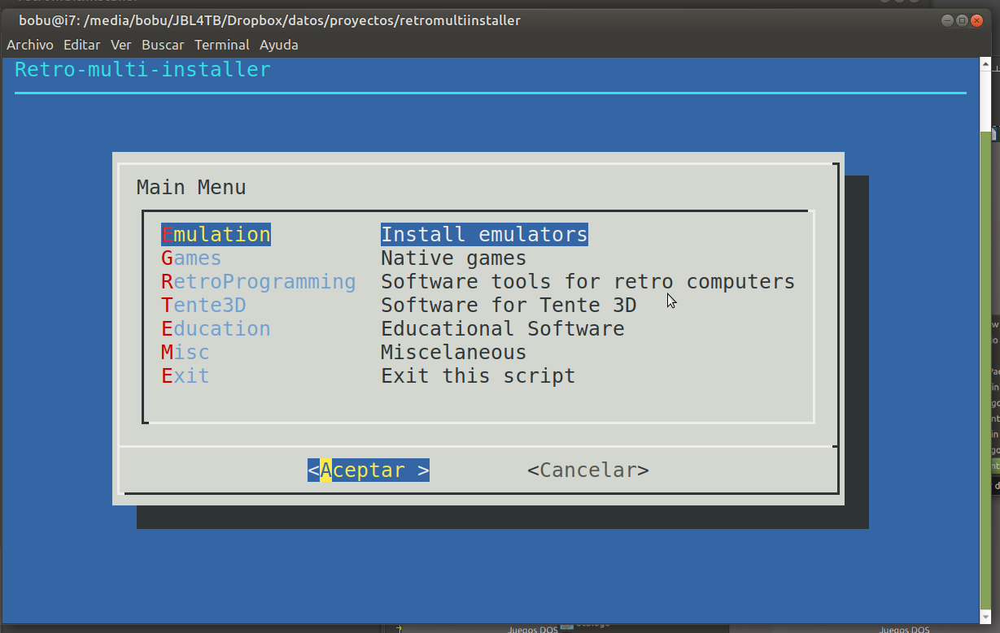

# Multi retro utils installer
Script to install more common retro computers emulators and tools in GNU/Linux (Debian/Ubuntu family distros).
There will be a full operative shortcut in menu for each graphic software you install.

> ADVICE: THIS SCRIPT DOESN'T INCLUDE ANY ILLEGAL ROM, BIOS OR ANY QUESTIONABLE SOFTWARE.

You can see the menus on English or Spanish depending of your locale configuration.

## Emulators included
### Amstrad
- [Arnold (by Rofl0r)](https://github.com/rofl0r/arnold).  
- [Caprice 32 (by Colin Pitrat)](https://github.com/ColinPitrat/caprice32).  
- [CPCEC (by CNG Soft)](http://cngsoft.no-ip.org/cpcec.htm).  
- [Java CPC emulator](http://cpc-live.com/data/).  
- [Joyce PCW/Anne emulator (by John Elliott)](http://www.seasip.info/Unix/Joyce).  
- [WinAPE](http://www.winape.net/) 

### Atari ST
- [Hatari](https://hatari.tuxfamily.org/)  

### Apple
- [BasiliskII](https://basilisk.cebix.net/)  
- [LinApple](https://github.com/linappleii/linapple)  

### Commodore
- [FS UAE](https://fs-uae.net)  
- [VICE](http://vice-emu.sourceforge.net/)  

### MSX
- [OpenMSX](https://openmsx.org/)  

### ZX Spectrum
- [FBZX](https://rastersoft.com/programas/fbzx.html)  
- [FUSE](http://fuse-emulator.sourceforge.net/)  
- [XSPECT](https://github.com/radekp/spectemu/blob/master/README)  

### Arcade
- [Cannonball](https://github.com/djyt/cannonball)  
- [MAME](https://mame.net)  

### Consoles
- [DesmuME](http://desmume.org/)  
- [Osmose](https://segaretro.org/Osmose)  
- [PCSXR](https://github.com/iCatButler/pcsxr)  
- [PCSX2](https://pcsx2.net/)  
- [Stella](https://stella-emu.github.io/)  
- [ZSNES](http://www.zsnes.com/)  

### Several systems
- [Higan](https://byuu.org/higan/)  
- [Mednafen](https://mednafen.github.io/)  
- [PCEM](https://pcem-emulator.co.uk).  
- [Retro Virtual Machine (by Juan Carlos González Amestoy)](https://www.retrovirtualmachine.org/). 
- [Zesarux (by Ceśar Hernández Bañó)](https://github.com/chernandezba/zesarux).  

### Just OS emulators
- [Dosbox](https://www.dosbox.com/)  
- [WINE](https://www.winehq.org/) 
- [ANSI CP/M](https://github.com/z88dk/cpm)  
- [IZ CP/M](https://github.com/ivanizag/iz-cpm)  

## Games
### Full natives
- [Antimicro](https://github.com/AntiMicro/antimicro)  
- [Abbey of crime extensum](http://www.abadiadelcrimenextensum.com/)  
- [Abu Simbel Profanation DeLuxe](https://computeremuzone.com/ficha/598/) 
- [LPairs 2](http://lgames.sourceforge.net/LPairs/)  
- [Minetest](https://www.minetest.net/) with [Mineclone 2](https://malagaoriginal.blogspot.com/2019/03/minetest-con-mineclone-2-en-gnulinux-y.html) included.  
- [Rocks'n'Diamonds](https://www.artsoft.org/rocksndiamonds/)  
- [Step Mania](https://www.stepmania.com/)  
- [UWOL](https://www.mojontwins.com/juegos_mojonos/uwol-quest-for-money/)  
- [Vorton, a Highway Encounter remake](https://github.com/zerojay/vorton)  

## Engines with shareware/freeware/gnu data
- [OpenTyrian](https://github.com/opentyrian/opentyrian)  
- [Rise of the Triad](https://icculus.org/rott)  
- [RVGL Re-Volt](https://rvgl.re-volt.io/)  
- [The Legend of Zelda: Mystery of Solarus DX](https://www.solarus-games.org/en/games/the-legend-of-zelda-mystery-of-solarus-dx)  

## TENTE 3D
- [MLCad](http://mlcad.lm-software.com/) 
- [LDView](http://ldview.sourceforge.net/) 
- [Blender](http://www.blender.org) + [Ldraw import addon](https://github.com/TobyLobster/ImportLDraw/releases)  
- [BMP2LDraw](https://www.dropbox.com/s/a82giwfiof15ld5/bmp2ldraw.zip?dl=1) 
- [LDDesignPad](https://sourceforge.net/projects/lddp) 
- [LD4Studio](http://www.ld4dstudio.nl)  
- [LDCad](http://www.melkert.net/LDCad)  
- [LeoCad](https://github.com/leozide/leocad)  

[TENTE 3D](https://www.dropbox.com/s/irba95qphdxtiq7/LDrawTente_Ultima.zip?dl=0) y [LEGO 3D](http://www.ldraw.org) supported.

## Educational software
### Celestia
- [Celestia](https://celestia.es/)  

## Tools for retro
### Programming
- [CPCTelera (by L.Ronaldo)](https://github.com/lronaldo/cpctelera).  
- [CPCTools (by Ralferoo)](https://github.com/ralferoo/cpctools).  
- [Pasmo Z80 Cross Assembler](http://pasmo.speccy.org/).  
- [SDCC - Small Device C Compiler](http://sdcc.sourceforge.net/).  
- [Z88DK - The Development Kit for Z80 Computers](https://github.com/z88dk/z88dk).  

### tools
- [ConvImgCPC](https://cpcrulez.fr/emulateurs_UTIL-GRA-convimgcpc.htm) 
- [CPCDiskXP](http://www.cpcmania.com/cpcdiskxp/cpcdiskxp.htm) 
- [ZX Editor](https://zx-editor.software.informer.com) 

### Retro Languages
- [BBC Basic](https://github.com/rtrussell/BBCSDL). 
- [QB64](http://www.qb64.net/). 
- [ZX Basic](https://zxbasic.readthedocs.io)  
- [P65Pas](https://github.com/t-edson/P65Pas)  
- [KTurtle Logo](https://edu.kde.org/kturtle/)  
- [UCB Berkeley Logo](https://people.eecs.berkeley.edu/~bh/logo.html)  

#### Legend
 Compiled from source code.

 Deb package.

 Pure binary with no source code.

 Pure java binary with no source code.

 Windows software compatible with GNU/Linux using wine.

 Raspberry pi compatible.

## How to use
Just type ./retroinstaller.sh and select the desired emulator or tool.

## How to modify
* Own installations script: add your script with a name like *yourscriptkey_installer.sh* in installer folders.
* Menu items: You can add this scripts in the menu using **.menus* files in menu director, first add the yourscriptkey as a word  without spaces, then an space and finally the description than can't contain real spaces only hard spaces.
* Shotcuts: you need to add these files:
   * shotcuts/etc/xdg/menus/applications-merged/yourscriptkey.menu
   * shotcuts/usr/share/applications/yourscriptkey.desktop
   * shotcuts/usr/share/pixmaps/yourscriptkey.png
* Temporal dir to save code and other elements: opt

## About
For more details see my blogs:

- [Selections of M.O.L](https://malagaoriginalenglish.blogspot.com/) (a selection of articles on English).
- [Malagueños Originales y Libres](https://malagaoriginal.blogspot.com) (on Spanish, more complete).
